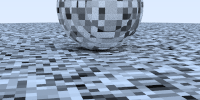
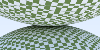

```markdown

```

<div
    style="width: auto; text-align: center; margin: 0 auto; padding: 0"
>
    <h1 align="center">Ray_tracing</h1>
    <h2 align="left">示例截图</h2>
    <div align="center">
     <div style="margin: 20px">
            <a
                style="margin: 10px"
                href="./cpp1/pics/box.png"
                title="box"
                ></a>
            <a
                style="margin: 10px"
                href="./cpp1/pics/camera.png"
                title="camera"
                ></a>
           <a
                style="margin: 10px"
                href="./cpp1/pics/dielectric.png"
                title="dielectric"
                ></a>
         <a
                style="margin: 10px"
                href="./cpp1/pics/diffuse.png"
                title="diffuse"
                ></a>
        </div>

<div align="center">
<div style="margin: 20px">
            <a
                style="margin: 10px"
                href="./cpp1/pics/final.png"
                title="final"
                ></a>
    <a
                style="margin: 10px"
                href="./cpp1/pics/gamma.png"
                title="gamma"
                ></a>
    <a
                style="margin: 10px"
                href="./cpp1/pics/metal.png"
                title="metal"
                ></a>
    <a
                style="margin: 10px"
                href="./cpp1/pics/next.png"
                title="next"
                ></a>

  <div align="center">
<div style="margin: 20px">
            <a
                style="margin: 10px"
                href="./cpp1/pics/trynew.png"
                title="trynew"
                ></a>
    <a
                style="margin: 10px"
                href="./cpp1/pics/turb.png"
                title="turb"
                ></a>
    <a
                style="margin: 10px"
                href="./cpp1/pics/two_perlin_spheres.png"
                title="two_perlin_spheres"
                ></a>
    <a
                style="margin: 10px"
                href="./cpp1/pics/two_sphere.png"
                title="two_sphere"
                ></a>

<div align="center">
<div style="margin: 20px">
            <a
                style="margin: 10px"
                href="./cpp1/pics/smoke.png"
                title="smoke"
                ></a>
    <a
                style="margin: 10px"
                href="./cpp1/pics/test.png"
                title="test"
                ></a>
    <a
                style="margin: 10px"
                href="./cpp1/pics/texture.png"
                title="texture"
                ></a>
    <a
                style="margin: 10px"
                href="./cpp1/pics/trilinear_interp.png"
                title="trilinear_interp"
                ></a>


        </div>
    </div>
</div>